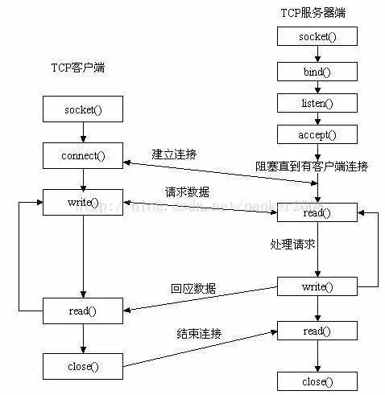

# Computer Network

1. 物理层
	* 通信方式：单工，半双工，双工
	* 电路交换，报文交换，分组交换
	* 分组交换：数据报，虚电路
	* 设备：中继器，集线器 
2. 数据链路层
	* 组帧：将网络层传下来的分组添加首部和尾部，用于标记帧的开始
	* 透明传输：在数据部分出现首部和尾部相同的内容前插入转义字符，若出现转义字符，则在转义字符前面再加一个转义字符
	* 差错控制：CRC校验
	* 流量控制
		* 停止等待
		* 后退n帧（GBN）
		* 选择重传（SR）
	* 介质访问
		* 信道划分
			* 频分复用
			* 时分复用
			* 统计时分复用
			* 波分复用
			* 码分复用
		* 随机访问
			* ALOHA
			* CSMA：1坚持，非坚持，p坚持
			* CSMA/CD
				* 多点接入
				* 载波侦听
				* 碰撞检测
			* CSMA/CA
		* 轮询访问
	* 广域网帧
	* 设备：网桥，交换机
3. 网络层
	* IP地址编址
		* 分类
		* 子网划分
		* CIDR
	* 地址解析协议（ARP）
		* 由IP地址得到MAC地址
		* 每个主机都有一个ARP缓存，里面包含了本地局域网上各主机和路由器的IP地址到MAC地址的映射表
		* 如果主机A知道主机B的IP地址，但是ARP缓存中没有该IP地址到MAC地址的映射，此时主机A通过广播的方式发送ARP请求分组，主机B收到该请求分组后会发送ARP响应分组给主机A告知其MAC地址，随后主机A向其高速缓存中写入主机B的IP地址到MAC地址的映射
	* 网际报文控制协议（ICMP）
		* 更有效转发IP数据报和提高交付成功的机会
		* 差错报告报文：终点不可达，时间超过，参数问题，改变路由
		* 询问报文：回送请求或回答，时间戳请求或回答
		* Ping：ICMP的重要应用，用来测试两台主机之间的连通性（发送回送请求报文）
		* Traceroute：用来跟踪一个分组从源点到终点的路径
	* 网际组管理协议（IGMP）
	* 路由选择协议
		* 自治系统内部：RIP和OSPF
		* 自治系统间：BGP
4. 传输层
	* UDP与TCP的特点
		* UDP是无连接，TCP有连接
		* UDP面向报文，TCP面向字节流
		* UDP支持一对一，一对多，多对一和多对多，TCP连接只能是点对点
		* TCP提供可靠交付，有流量控制，拥塞控制
	* TCP三次握手
		* 客户端 SYN=1，seq=x
		* 服务器 ACK=1，seq=y,ack=x+1
		* 客户端 ACK=1, seq=y+1,ack=y+1
		* 第三次握手是为了防止失效的连接请求到达服务器，让服务器错误打开连接
	* TCP四次挥手
		* 客户端 FIN=1，seq=u
		* 服务器 ACk=1，seq=v，ack=u+1
		* 服务器 FIN=1，ACK=1，seq=w，ack=u+1
		* 客户端 ACK=1，seq=u+1，ack=w+1
		* 客户端接收到服务端的FIN报文进入TIME_WAIT状态
			* 确保最后一个确认报文能够到达（客户端发送给服务器的报文）
			* 让本连接持续时间内所产生的所有报文都从网络中消失
	* TCP可靠传输：超时重传
	* TCP流量控制：控制发送方的发送速率，接收方发送的确认报文中的窗口字段
	* TCP拥塞控制
		* 流量控制是为了让接收方能来得及接收，而拥塞控制是为了降低整个网络的拥塞程度
		* 慢开始与拥塞避免：从1开始，指数递增，达到慢开始门限，每次递增1
			* 如果出现超时，则令慢开始门限=此时窗口的二分之一，窗口重新从1开始
		* 快重传与快恢复：在发送方，如果收到三个重复确认，那么可以知道下一个报文段丢失，立即重传下一个报文段
			* 在这种状况下，只是个别报文段的丢失，而不是网络拥塞。因此执行快恢复，则令慢开始门限=此时窗口的二分之一，窗口从慢开始门限开始
		* 注意慢开始和快恢复开始的设定值
5. 会话层
6. 表示层
7. 应用层
	* 域名系统 DNS域名解析，53号端口
	* 文件传送协议 FTP 使用TCP连接 
	* 动态主机配置协议 DHCP 自动配置IP地址，子网掩码，网关IP地址
*  Web页面请求过程
	*  DHCP配置主机信息
		*  假设主机最开始没有IP地址及其他信息，就需要使用DHCP获取
		*  主机生成一个DHCP请求报文，进行广播
		*  连接在交换机上的DHCP服务器收到广播帧后，生成DHCP ACK报文
	*  ARP解析MAC地址
		*  DHCP过程只知道网关路由器的IP地址，为了获取网关路由器的MAC地址，需要使用ARP协议
		*  主机生成ARP查询报文，然后进行广播，网关路由器收到该帧后，发送ARP回答报文  
	*  DNS解析域名
		*  根据两种路由选择协议，路由表中配置了网关路由器到达DNS服务器的路由表项
		*  主机生成DNS查询报文，通过网关路由器然后到达DNS服务器
		*  DNS服务器发送DNS回答报文
	*  HTTP请求页面
		*  根据HTTP服务器的IP地址，生成TCP套接字
		*  三次握手建立连接
		*  浏览器生成HTTP GET请求
		*  HTTP服务器生成HTTP响应报文，浏览器收到响应报文后，抽取Web页面内容进行渲染，最终显示页面
*  HTTP
	*  HTTP状态码
		*  1XX 信息性状态码 接收的请求正在处理
		*  2XX 成功状态码 请求正常处理完毕
		*  3XX 重定向状态码 需要附加操作以完成请求
		*  4XX 客户端错误状态码 服务器无法处理请求
		*  5XX 服务器错误状态码 服务器处理请求出错
	*  长连接与短连接
		*  当浏览器访问一个包含多张图片的HTML页面时，除了请求访问的HTML页面资源，还会请求图片资源，如果每进行一次HTTP通信就要新建一个TCP连接，那么开销会很大
		*  HTTP/1.1开始默认使用长连接
	*  流水线
		*  默认情况下，HTTP请求是按顺序发出，下一个请求只有当前请求收到响应之后才会发出
		*  流水线是在同一条长连接上连续发出请求，而不用等待响应返回，这样可以减少延迟
	*  虚拟主机
		*  HTTP/1.1使用虚拟主机技术，使得一台服务器拥有多个域名
	*  HTTPS
		*  使用SSL（安全套接层）和TLS（传输层安全）协议把通信内容加密后经网络隧道传输
	*  HTTP/1.1
		*  默认长连接，支持流水线
		*  支持虚拟主机，支持同时打开多个TCP连接
	*  HTTP/2.0
		*  HTTP/1.x实现简单是以牺牲性能为代价的
			*  客户端需要使用多个连接才能实现并发和缩短延迟
			*  不会压缩请求和响应头部，从而导致不必要的网络流量
			*  不支持有效的资源优先级，致使底层TCP连接的利用率低下
		*  HTTP/2.0
			*  二进制分帧，将报文分为HEADERS帧和DATA帧，都是二进制的
			*  在通信过程只会有一个TCP连接，，承载了任意数量的双向数据流
			*  在客户端请求一个资源时，会把相关的资源一起发给客户端
			*  客户端和服务器共同维护和更新一个包含之前见过的首部字段表，从而避免了重复传输

* Socket
	* 套接字，计算机之间进行通信的一种方式
	* 进程通信
		* 低级：进程的互斥和同步
		* 高级：
			* 共享存储器：共享数据结构，共享存储区
			* 管道通信系统
			* 消息传递系统
			* C/S系统：套接字，远程过程调用RPC
	* Socket函数
	
	* Socket缓存区
	
	* 一个输入操作通常包含两个阶段：
		* 等待数据准备好
		* 从内核向进程复制数据
	* 对于一个套接字上的输入操作
		* 等待数据从网络中到达，当数据到达时，复制到内核缓冲区
		* 把数据从内核缓存区复制到应用进程缓存区
	* 五种I/O模型
		* 阻塞式I/O
			* 应用进程被阻塞，直到数据从内核缓冲区复制到进程缓冲区中才返回
			* 在阻塞过程，其他进程还可以执行因此阻塞并不意味着整个操作系统都被阻塞，所以不消耗CPU时间，所以CPU利用率会比较高
			* recvfrom()
		* 非阻塞式I/O
			* 应用进程可以继续执行，但是需要不断地执行系统调用来获知I/O是否完成。这种方式称为轮询
		* I/O复用
			* 使用select或者poll等待数据，并且可以等待多个套接字中任何一个变为可读。这一过程会被阻塞，当某一个套接字可读时返回
			* 它可以让单个进程具有处理多个I/O事件的能力
			* 如果一个Web服务器没有I/O复用，那么每一个Socket连接都需要创建一个线程去处理。
		* 信号驱动式I/O
			* 等待数据阶段应用进程是非阻塞的，内核在数据到达时向应用进程发送信号，应用进程收到信号后将数据从内核复制到应用进程
		* 异步I/O
			* 应用程序继续执行，不会被阻塞，内核会在所有操作完成之后向应用进程发送信号
			* 异步I/O的信号是通知应用进程I/O完成，而信号驱动I/O的信号是通知进程可以开始I/O
		* 同步I/O将数据从内核缓冲区复制到应用进程缓冲区的阶段，应用进程会被阻塞，而异步I/O则不会
		* select，poll，epoll都是I/O复用的具体体现
			* select使用数组实现，调用select会一直阻塞直到有描述符事件到达或者等待时间超过timeout
			* poll使用链表实现
				* select会修改描述符，而poll不会
				* select和poll每次调用都需要将全部描述符从应用进程缓冲区复制到内核缓冲区
			* epoll中已被注册的描述符在内核中会被维护到一棵红黑树上，epoll只需要将描述符从进程缓冲区向内核缓冲区拷贝一次，epoll没有描述符的限制
			* select的timeout精度为1ns，而poll和epoll为1ms，因此select更加适用于实时性要求比较高的场景
			* 需要同时监控小于1000个描述符就没有必要使用epoll，因为无法体现epoll的优势	